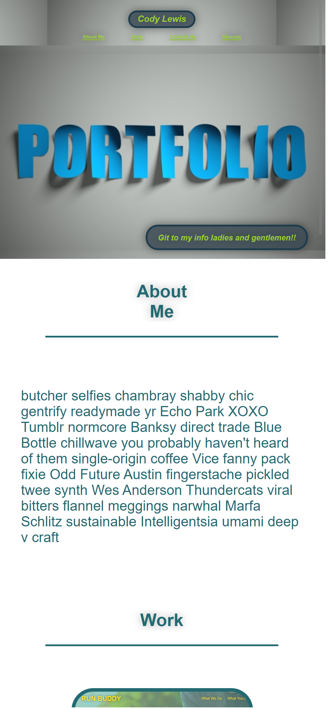

# lewisportfolio

## Table of Contents 

* [Installation](#installation)
* [Html changes](#html-changes)
* [CSS changes](#css-changes)
* [Link to site](#link-to-site)
* [Portfolio Pic](#portfolio-pic)
* [Screenshot](#screenshot-of-landing-page)
* [Credits](#credits)
* [License](#license)

I built this site to display a portfolio of myself; there is not much now but I will be adding as I go along. I left the Lorem Ipsum text in as I do not know what to say about myself at this time; I expect by the time I am done with this BootCamp I will have this all filled out and even multiple pages to this expanding portfolio. Please enjoy what I can provide at this time. 

## Installation

Click the link to site in this README and it will take you to the landing page for the site. 

## Html changes

// Html changes //

At this time all HTML is new and any changes in the future will be updated here...

# CSS changes
/* CSS changes */ 

At this time all HTML is new and any changes in the future will be updated here...

## Link to site

https://lewisoutdoorllc.github.io/lewisportfolio/

## Portfolio Pic

## Screenshot of landing page

## Credits

Thanks for all the help from Kip my partner on this little venture for making this happen with everything; we spent over 40 hours and finally got this thing ironed out. Cheers..

## License

Copyright (c) 2012-2020 Scott Chacon and others

Permission is hereby granted, free of charge, to any person obtaining
a copy of this software and associated documentation files (the
"Software"), to deal in the Software without restriction, including
without limitation the rights to use, copy, modify, merge, publish,
distribute, sublicense, and/or sell copies of the Software, and to
permit persons to whom the Software is furnished to do so, subject to
the following conditions:

The above copyright notice and this permission notice shall be
included in all copies or substantial portions of the Software.

THE SOFTWARE IS PROVIDED "AS IS", WITHOUT WARRANTY OF ANY KIND,
EXPRESS OR IMPLIED, INCLUDING BUT NOT LIMITED TO THE WARRANTIES OF
MERCHANTABILITY, FITNESS FOR A PARTICULAR PURPOSE AND
NONINFRINGEMENT. IN NO EVENT SHALL THE AUTHORS OR COPYRIGHT HOLDERS BE
LIABLE FOR ANY CLAIM, DAMAGES OR OTHER LIABILITY, WHETHER IN AN ACTION
OF CONTRACT, TORT OR OTHERWISE, ARISING FROM, OUT OF OR IN CONNECTION
WITH THE SOFTWARE OR THE USE OR OTHER DEALINGS IN THE SOFTWARE.
